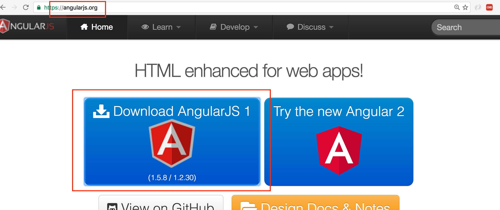
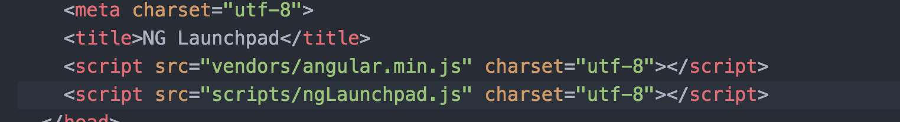
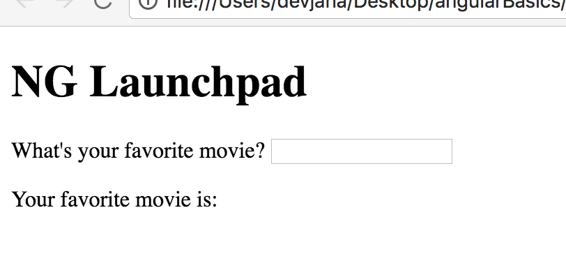
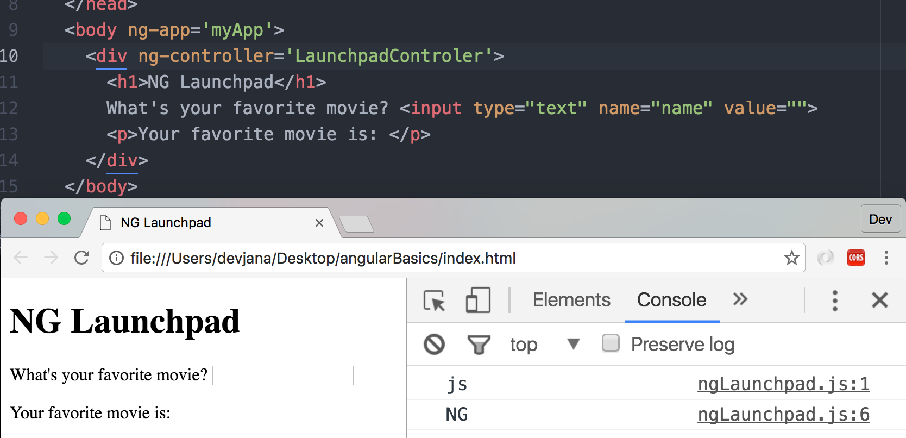

NG Launchpad
============


Overview
--------
In this guide we'll set up a very simple client-side page that will use AngularJS. You'll need familiarity with HTML, and JS.

Steps:
------
* download AngularJS (1.5)
* set up basic project JS
* set up basic project HTML
* our first 2-way bind
* our first ng-click
* food for thought

download AngularJS (1.5)
========================

First, you'll need to download Angular JS from ajngularjs.org. As of the time of writing, Angular 1.5 is the current, stable release:



Make sure you download Angular 1.5 and save "angular.min.js" in a place where it'll be accessible for this project as well as future ones.


set up basic project: JS
========================
We'll need the absolute basics to take a peek at Angular:
* 'index.html'
* 'vendors' folder with 'angular.min.js' within
* 'scripts' folder
* create 'ngLaunchpad.js' within this folder
* src these files with in index.html and make sure to source angular prior to our script (ngLaunchpad.js)


Next we'll set up some basic HTML scaffolding. Just an input field and a P tag


Nothing special yet, but let's start adding some AngularJS:

In ngLaunchpad.js:
------------------
We'll be using the very basics of Angular first - we'll create an app and a controller for use within this app.

Add the following:
```javascript
var myApp = angular.module( 'myApp', [] );
```

This will create an AngularJS (AKA "ng", I guess because aNGular...) app. names 'myApp'.

We'll also need to create a controller for myApp. This controller will define the scope of any variables/objects/functions/etc. and connect the scripts to our DOM. If that sounds weird, don't worry. Let's get one spun up, see how it works, the pick it apart a bit.

(AngularJS.org's documentation of ng controllers: https://docs.angularjs.org/api/ng/directive/ngController)

First, let's add the controller to our client-side script.  Add the following at the bottom of the ngLaunchpad.js file:

```javascript
myApp.controller( 'LaunchpadControler', [ '$scope', function( $scope ){
  console.log( 'NG' );
}]);
```
A few things are happening here:
* adding a controller to myApp
* naming the controller
* injecting the $scope dependency
* console log that angular is working within our 1st controller within our first app


set up basic project HTML
=========================
Now that we've got our JS set up we'll need to hook it up to our HTML.

* add an 'ng-app' tag to the body element of your html
* this will be set to the app in our js file ('myApp' in this case)
```html
<body ng-app='myApp'>
```
By doing that we've told the page to use 'myApp' for the entire body of the HTML, which is fine for right now. Now that we've got myApp in our HTML we'll also want to add a space where the our controller will be able to do some work. Add a div in which we can put the existing input and output elements:

```html
<div ng-controller='LaunchpadControler'>
  <h1>NG Launchpad</h1>
  What's your favorite movie? <input type="text" name="name" value="">
  <p>Your favorite movie is:</p>
</div>
```
You html file should now have an ng-app element on the body that tells the page we'll be using "myApp" throughout the body. Also, it should have a div within the body that makes use of the controller "LaunchpadControler":

When you open this file now and look at the console. you should see that NG is working from:



Now that we've got Angular hooked up, let's do some magic...

our first 2-way bind
====================

Alright, let's make this baby dance...
We're going to hook up a simple 2-way bind. We've seen that we've set the body to use 'myApp' as its ng-app and we've added a div which uses 'LaunchpadControler' as its ng-controller. This will allow us to use Angular within this divv and manipulate it within our controller.

First, let's do some simple 2-way binding DOM manipulation. Update your LaunchpadControler div to read as follows:

````html
<div ng-controller='LaunchpadControler'>
  <h1>NG Launchpad</h1>
  What's your favorite movie? <input type="text" name="name" value="" ng-model='movieName'>
  <p>Your favorite movie is: {{ movieName }}</p>
</div>
```

This created an 'ng-model' and bound it to our input field. Now, anything input here by the user is held in the 'movieName' model. Check out those double curly braces in the bottom p element. That is an 'expression'. It allows a 'two-way bind' from that expression to the "movieName" model. Save and refresh your page. You'll notice that as you type in the input field the expression is automatically updated in real time!!!
M4G1C!!!!

our first ng-click
==================
Now that we've got an ng-model named "movieName" in the div that is controlled by the controller that is in our app and we've two-way bound it to the DOM, let's add a button that will use Angular's 'ng-click' and do something with the movieName field.

* add a button to the html
* give it an ng-click tag of 'getMovieName' as a function

```html
<button ng-click='getMovieName()'>Get Movie Name</button>
```

'ng-click' is an angular event much like "onClick" in vanilla JS. Here it is telling our button to run the "getMovieName" function. Let's add that function in our JS. Update the controller to read as follows:

```javascript
myApp.controller( 'LaunchpadControler', [ '$scope', function( $scope ){
  console.log( 'NG' );
  $scope.getMovieName = function(){
    console.log( 'in getMovieName()');
    console.log( 'movieMame:', $scope.movieName );
  }; // end getMovieName
}]);
```

This will create the 'getMovieName' function within the scope of our controller. This is why $scope is used in the JS. You'll note that we are able to access movieName from the HTML as $scope.movieName in the js file. Also, 'getMovieName()' is used in the HTML, but '$scope.getMovieName()' is used in the js file.

Refresh the page now and you'll see that the same functionality happens as before, but we also have that new button. Click it and you'll see that the script logs out our favorite movie. Not only is our ng-model of movieName two way bound on the DOM through input and expression, but it is also available to our controller in the js file! How cool is that?!?!?


All of this is happening within our controller in the js and within the div in our html.

![scope in html and js]

food for thought
================
This is a simple example of how Angular works on the front end. Next steps:
* recreate this!
* add an array that holds all the favorite movies that have been input on button click
* console log out that array
* research ng-repeat and see if you can get that info on the DOM
